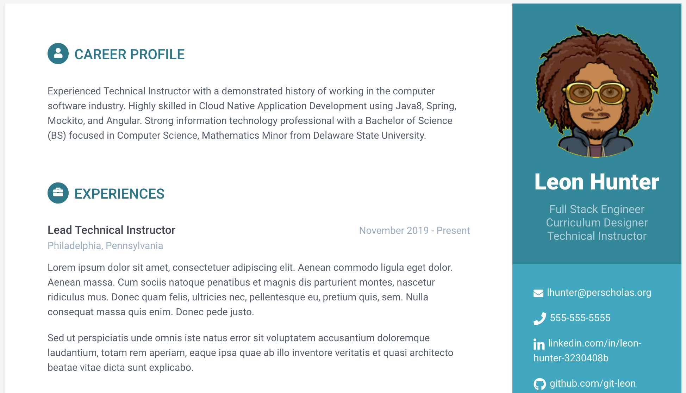

# My First Portfolio

* **Objective** - To create a personalized portfolio detailing yourself.
* **Purpose** - To establish familiarity with CSS and basic HTML.
* **Description**
    * You are provided with an `index.html` document at the root of this project.
    * Edit the document by adding information about yourself to it.
    * This will be accomplished over the course of several days.
    * The objective is to achieve a portfolio which resembles the image below.

## Part 1 - Clone the project

* Begin by _forking_ this project into a personal repository.
   * To do this, click the `Fork` button located at the top right of this page.
* Navigate to your github profile to find the _newly forked repository_.
* Clone the repository from **your account** into the `~/dev` directory.
* Open the newly cloned project in a code editor (Visual Studio Code, for example).

### Part 2 - Edit the _cloned_ project

* from a text editor (i.e. - Visual Studio Code), select:
  * `File` > `Add Folder to WorkSpace`
    * select the `dev` directory 
  * from the text editor, in the `dev` directory, locate the newly cloned project
    * expand the project from the _project explorer_
    * modify the `index.html` by adjusting the data to fit your persona.
  
  

### Part 3 - _Pushing_ new changes to repository

* from a _terminal_ navigate to the root directory of the _cloned_ project.
* from the root directory of the project, execute the following commands:
    * `git add .`
        * add all files in current directory to be indexed        
    * `git commit -m 'I have made an edit to a file!'`
        * save all indexed changes to local repository
    * `git push -u origin master`
        * push changes from local repository to remote repository

### Part 4 - Submitting assignment

* from the browser, navigate to the _forked_ project from **your** bitbucket account.
* click the `Pull Requests` tab.
* select `New Pull Request`